# 🏗️ Veritas Hybrid Architecture

This document explains how the Veritas Protocol operates in a **Hybrid Mode** (Cloud + Local).

## The Concept

We have split the system into two distinct parts based on their "Time Physics":

1. **The Face (Frontend)**: Needs to be fast, global, and accessible 24/7. -> **Vercel**
2. **The Brain (Agents)**: Needs to run forever, loop continuously, and hold private wallet keys. -> **Local (PM2)**

## Visual Diagram

```mermaid
graph TD
    subgraph CLOUD ["☁️ THE CLOUD (Public & Secure)"]
        User((User/Client))
        Admin((You/Admin))
        
        Vercel["🌐 Vercel (Dashboard)"]
        Supabase[("🗄️ Supabase (The Bridge)")]
        
        User -->|Visits| Vercel
        Admin -->|Commands| Vercel
        Vercel <-->|Reads/Writes| Supabase
    end

    subgraph LOCAL ["🏠 YOUR MACHINE (The Fortress)"]
        PM2["⚙️ PM2 (Process Manager)"]
        
        Router["🤖 Router Agent"]
        Treasurer["🏦 Treasurer Agent"]
        Hunter["🔫 Hunter Agent"]
        
        PM2 --> Router
        PM2 --> Treasurer
        PM2 --> Hunter
        
        Router <-->|Polls Commands| Supabase
        Treasurer <-->|Updates Balance| Supabase
        Hunter <-->|Logs Leads| Supabase
    end
    
    style Vercel fill:#000,stroke:#fff,color:#fff
    style Supabase fill:#3ecf8e,stroke:#3ecf8e,color:#000
    style LOCAL fill:#ffebeb,stroke:#f00
```

## Why this setup?

### 1. Vercel (The Frontend)

* **What it does:** Hosts the `protocolo-veritas` React app.
* **Why:** Vercel is built for "Serverless" websites. It wakes up when a user visits, serves the page, and goes back to sleep.
* **Limitation:** It **cannot** run a script for more than 10-60 seconds. If `hunter_agent.js` tries to run there, Vercel will kill it after 10 seconds. Agents need to run for *hours*.

### 2. Local PM2 (The Backend)

* **What it does:** Runs your Node.js scripts (`router`, `treasurer`, `hunter`) using `PM2`.
* **Why:** Your computer (or a generic VPS) allows scripts to run *forever*. PM2 ensures that if they crash, they restart automatically.
* **Security:** Your Wallet Private Keys stay on your physical disk (`.treasurer-wallet.json`). They strictly never leave your machine.

### 3. Supabase (The Bridge)

* They don't talk directly. They talk via **Supabase**.
* **Command Flow**:
    1. You type "Start" in Vercel.
    2. Vercel writes "Start" to `agent_commands` table.
    3. Local Router (polling every 5s) sees "Start" in the table.
    4. Local Router executes the code.
